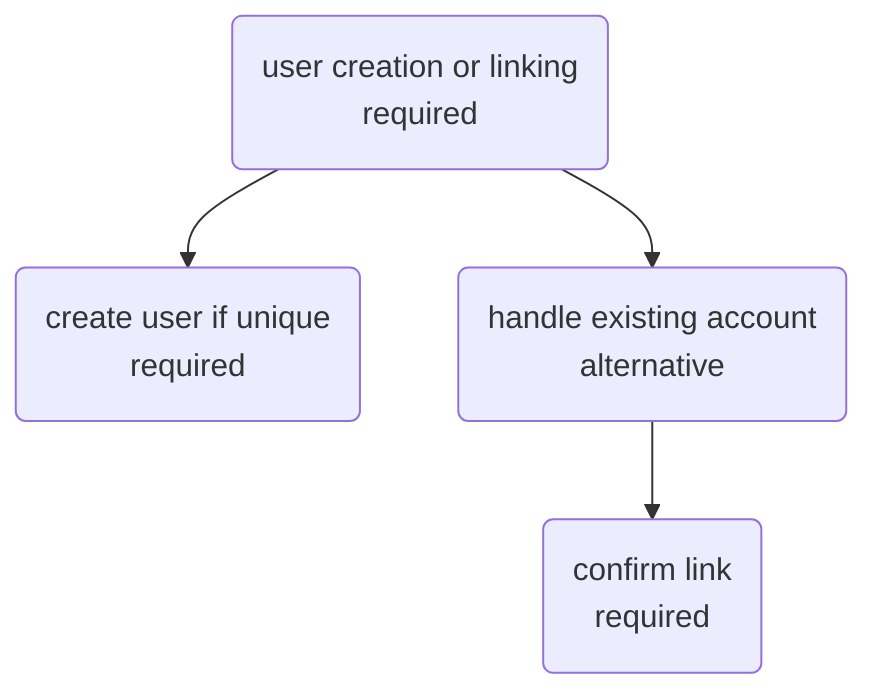
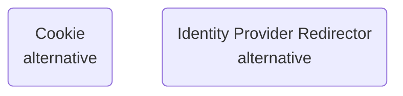

# Keycloak

## Source
We're using the codecentric [helm chart](https://github.com/codecentric/helm-charts/blob/master/charts/keycloak/Chart.yaml) that conveniently comes with kc 16 (upgrade to 17 soon) and postrges 10 (check if can be migrated to 14?).

The deployment p much consists of two pods: keycloak and postgtres. Since keycloak is written in java - and we hate java - for monitoring logs we'll be hooking up to the postgres db instead as everything is stored there anyway, more on that later.

## Setup
Basically I created a copy of values.yaml - custom.yaml, this will make life easy when diffing future versions.

The current changes are:

Misc env setup:

- extraEnv:
    - KEYCLOAK\_USER
    - KEYCLOAK\_PASSWORD
    - KEYCLOAK\_LOGLEVEL: ERROR
    - WILDFLY\_LOGLEVEL: ERROR
    - PROXY\_ADDRESS\_FORWARDING: "true"
    - HTTP{,S}\_PROXY
    - NO\_PROXY

Keep the ingress as false as we're using traefik's ingressroute. The route is standard but we're adding an extra mimdleware to it (forgot why, but it did fix something):
```yaml
apiVersion: traefik.containo.us/v1alpha1
kind: Middleware
metadata:
  name: kc-buff
spec:
  buffering:
    maxRequestBodyBytes: 2000000
```

Then simply install/upgrade thru helm.

## Initialisation

Keycloak is accessible on the host defined in the ingress route - specifically the admin console. By default it logs us into the master realm. Unfortunately this is hardcoded and until redhat decides to do something about it, we're stuck with it. Fortunately no one but the admins themselves have this knowledge so the users never need to know.

This realm is special as it automatically sets up rules for any other realms that you set up. Aside from creating admin accounts for other keycloak admins, the best thing to do is to _not touch anything here_ and instead create a new realm.

### New realm

Our new realm - called dev, is straight forward to set up, simply add a realm, name it, give it a display name (what the users will see when logging into their console or ssoing). Take a note of the OpenID endpoint config url that's shown in realm settings - we can refer back to the links within when setting up apps.
Aside from that, we'll turn off all Login settings - simply because we're using our corporate provider and the users' emails have already been verified, and they will not be using passwords for anything. Additionally we don't want anyone registering so keep that turned off. That's all there is to it, virtually vanilla.

## Overview

Now that we have a realm set up we can take a quick look at what we have access to:

### Configure
#### Realm settings
Covered  briefly above, contains all realm-wide settings like emails, caches, policies and so forth.
#### Clients
This is where we register our app's authentications/authorizations
#### Client scopes
The scopes the clients have access to. By default p much all oauth apps will accept oid/openid scope and as such is not listed here. However other common ones are: email, profile, roles and so forth. Within each scope, individual mappers are set up (eg the `profile` scope has the knowledge about users' full name, username, email) and are fully customisable. This is also where we create and define our custom zone scope restricting our data scientists only to the zones they should have access to.

The default client scopes defines the scopes that should always be provided to any new clients, in our case it's just `profile` as not all apps will need the knowledge of user's zones, but they will always need to know their username. We also remove the originally provided ones, we've no use for them.

#### Roles
This is where realm roles are defined. In other words - client agnostic roles. Basically instead of assigning every user a specific role per every client, we can assign some overarching role, and this role will already contain the appropriate client mappings. An obvious example would be an admin role. Every time a new admin is onboarded, they should have access to all zones under all clients, so we create a _composite_ admin role, go thru every client, adding all zones and save. Then when a new admin is onboarded, we simply assign them the admin realm role.

#### Identity providers
The source of our openid identities. We're using our corporate provider, detailed instructions on setup are provided on their side. If registering a new app, make sure to pick the `Web App` option, that will guarantee an authorization code + PKCE flow - thus our users' will be authed with the certs their accounts carry by default already.

Note for other users: this is where you can link up your already existing identity such as github, discord, google, idk what else, follow _their_ documentation, they often provide everything out of the box with minimal setup required.

#### User Federation
This is where we can hook up our ldap identities. In our case i've been using a basic ldap database to have quick access to all, but in production we should unlink it completely and not use our ldap logins at all for any of the frontend apps. The set up is exactly the same as any other ldap app.

Note for other users: if you're using ldap as your only federation (and thus an identity provider), pay attention to the mappers, they might change depending on how you set up your ldap.

#### Authentication

This is where we define our flows - ie the steps users take during their registration/login and so forth, including actions to take like change passwords, set up otps and the like. 

### Manage

#### Groups
Again, a useful abstraction on top of roles. Rather than sifting thru realm and client roles on a user/client basis, useful groups can be created to contain these by default, eg admins - have access to the admin realm role, devs - have access to a dev realm role and a specific admin role in some client, and so on and so forth.

#### Users
All users existing within kc's db, whether they come from a federation, provider or directly registered. Individual group and role memberships can be assigned here, accounts cross-linked with providers, details and credentials set up.

#### Sessions
Kc keeps track of who's signed in and when their session expires, here the clients are listed (and linked back to the [Clients section](#clients)) where individual users' sessions are listed and can be manually revoked etc.

#### Events
We have two types of events - login and admin. Login ones carry information about whether user signed in for the first time, logged in again, updated their profile, etc. Admin events provide information on the keycloak level, eg user's roles have been changed, a new client has been added etc.

#### Import & Export
You can import/export an entire realm, or any other subsets like clients, users etc. in json format.


## Config

Here I'll show some practical examples of configuring clients, providers, users under the dev realm. This is all based off of a working set up, your implementation will differ based on your requirements.

### Identity provider
Since our company provides an openid service, we'll add an openid connect provider. Kc generates a redirect uri that is given to the identity provider. Since our corp users can only access our site from their corporate accounts which exist on the corporate AD, their emails can be trusted by default.

Since the corporate has generated a personal identification certificate for every user based off of their corporate id, we will not be using any of the standard password based flows, including here. For the first login flow we'll use the [customised registration flow](#our-registration), and for sync mode we'll simply import.

At this point we could manually fill out the auth url, token url, etc but fortunately we're provided with an external idp config so we just paste the url there and the  fields get populated, if anything is missing just match it to what the provider is supplying.

The username claim provided by our corp does not arrive under the `username` key but instead as `immutable_id`. By going into the provider's mappers we can create a mapper that inherits this attirbute and is saved as `username`.


### Authentication
Out of the box there's two main interesting flows for our use case: first broker login and browser login. We'll need to adapt them to our use case:

#### Our Registration
Create a copy of the first broker login and name it `Our Registration`. We'll strip it away until we're left with this flow:

#### Our Login
Create a copy of the browser flow and name it `Our Login`. Same as before, strip it til we get:

This will ensure that:

1. users are remembered between sessions
2. can _only_ sign in with their certs and no other way

In the case you're creating a login flow for the master realm for admin accounts (which should not come from the provider!) - i highly recommend to ask for a stupidly long password/passphrase. At the same time to make life more bearable, an otp policy can be set up here too.

### Realm Roles
We'll remove all default roles so any newly created user will have none. Once Some clients are set up we can create roles for ease of mapping, for now we'll skip.

### Client Scopes
Our users will need access to specific project files depending on which zone they belong to, let's call them zonea and zoneb. When they use an app(client) such as jupyter, it should have this knowledge and serve them corresponding files. In order to convey such information, a scope with mappers should be defined.

#### Create scope
We name our scope zoneAccess and make sure it's sent via openid and included in token scope.

#### Mappers
Here the individual mappers are set up, in other words this is the _key_ provided in the token. So why multiple mappers? Because we can granularise this further down, eg restrict a specific mapper to a specific client, pick whether we want to add it to a userinfo token or not and so forth.

However we'll keep it dead simple, create a new mapper `project zone mapper` as a `User Client Role` type. We don't specify a client ID so this map is available for all clients. We make sure it's multivalued and give it an easy token claim name `projectZones`. We'll also add it to the ID, access and userinfo tokens.

#### Scope
Finally under Scope we can now pick which realm/client roles we want to associate with this. For example under jupyter client we can pick `zonea` and `zoneb` from available roles and assign them. This means when jupyter will receive a token that will have the `zoneAcess` scope, it will look for a key called `projectZones` and accept any values that match `zonea` and `zoneb`. Whether a specific user has those values is then set under [User settings](#user-settings).

#### Other Scopes
The openid/oid scope is not listed here as its always provided by default.
Rather than digging thru all the email mappers under email scope, we can adjust the existing profile scope to provide a mapper for email (available as a builtin mapper). This way our clients will only need three mappers in total: openid, profile, zoneAccess.

### Clients
Now we'll register a client. How the setup works on the client side of things is very much app dependent. We will be registering [jupyterhub](https://zero-to-jupyterhub.readthedocs.io/en/latest/administrator/authentication.html#genericoauthenticator-openid-connect) where we must declare all endpoints (listed underrealm settings - openid endpoint) explicitly. Some other apps take care of this and will only ask for a discovery endpoint and deduce the rest from there.


#### Creation
Fairly straightforward, we name our client, give it a unique client id, enable it, give it a `confidential` access type and make sure authorization is enabled. The root url simply links to the app's domain and the `valid redirect uris` is the path provided by the client - in jupyter's case /hub/oauth\_callback.

The method to link client to kc is via credentials, so after creation under the `credentials` tab we copy the secret and copypaste that into the app's auth setup.

#### Roles
This is just a list of roles that are available for this client. So let's create three roles: zonea, zoneb, zonez. The zones themselves can have any attributes you want to give them, we'll leave it blank. Now note that based off of the setup in [client scopes](#client-scopes) only roles zonea and zoneb will be sent to jupyter. So if a user is assigned roles `zonea` and `zonez` for the jupyter client, _only_ `zonea` will be passed in the token - zoneb was never assigned to the user, and zonez was outside the scope.

#### Scope
Straightforward - we disallow full scope in order to have fine control.

#### Client Scopes
Under `setup` remove/add any desired default scopes, eg we want to have `profile` and `zoneAccess` always available by default.
The more interesting part here is the `Evaluate` tab, here we pick whatever scopes we want, whatever user we want and we can inspect the generated tokens and thus verify that a specific user is assigned exactly the roles we want them to have.

### Users
Finally, when a user has logged in for the first time they'll get their info pulled in from the provider and slapped in here. Due to our provider setup we can go straight to the useful stuff. Under `role mappings` we can assign the user specific realm/client roles and under `groups` specific groups that we've set up. 
### Events Ops
We will use events to do some automation - when a user logs in for the first time, we'll create some dedicated resources, and when their client role mapping changes we'll adjust some other resource. This information is passed down both via login and admin events.

By default both types of events are disabled, but by enabling them and having jboss-logging as the event listener. This is a very basic listener that spits out the logs into the login/admin events tabs. Unfortunately no plug n play webhook listener (that works on current versions) exists, and as kc is written in java which we all hate, we're not about to write one.

Instead we'll use the fact that these logs are stored in the postgres db kc comes with. We'll use my own written [postgres-webhook](https://github.com/jaybubs/postgres-webhook) that's adapted precisely to keycloak. It will wrap every event into a json and forward to whatever endpoint you want it to (change the code appropriately to match deployment parameters).
From here, we can be on the lookout for these conditions:

- for login event: .table:event\_entity, .record.details\_json.register\_method:broker, and fetch the username from .record.details\_json.username
- for admin event: .table:admin\_event\_entity, record.resource\_path: userid is here, check against .record.operation\_type and see what client roles have been created/deleted under .record.representation
